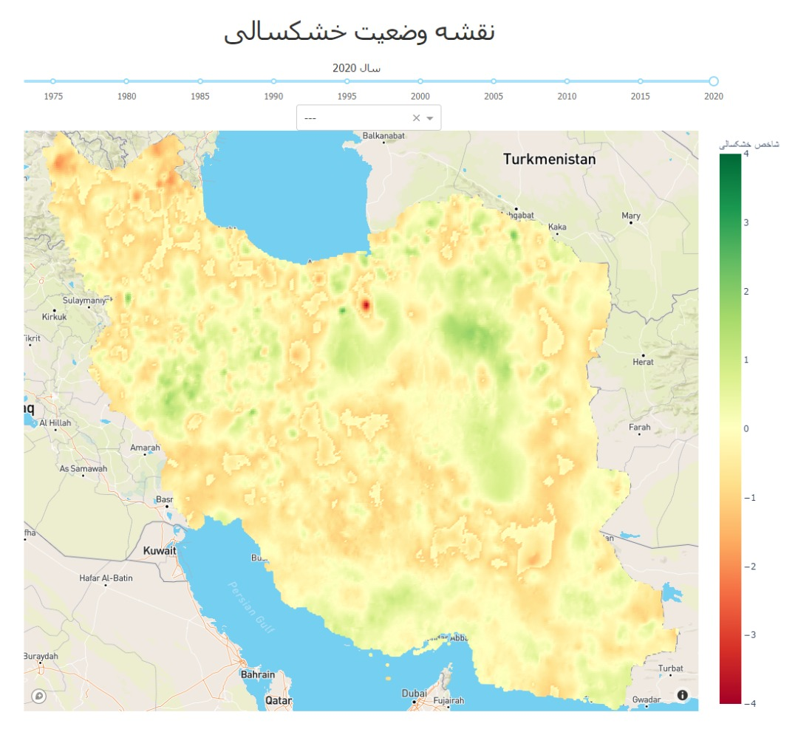

# Drought Heatmap

This module will produce plots and graphs of drought information in Iran, where the main map is a plotly express *scatter_mapbox* with the drought index information provided for around 60K points around the country. 

The requirements are set for serving the app via *gunicorn*. The port should be set according to the server admin. **The** `app.run_server(debug=True)` **should be changed to False for production.** 

##### Prerequisites:

install unixodbc:

`sudo apt-get install unixodbc unixodbc-dev`

download and install pyodbc driver for MSSQL server. 

https://docs.microsoft.com/en-us/sql/connect/odbc/download-odbc-driver-for-sql-server?view=sql-server-ver15

`pip install -r Reuqirements.txt`

##### Running the server:

`gunicorn -w 5 drought_heatmap:server -b :8050 --timeout 120`

or:

`python3 -m gunicorn -w 5 drought_heatmap:server -b :8050 --timeout 120`

*The timeout config is set to avoid errors on slow database connection.*

The number of workers should be decided in order to better handle simultaneous requests. According to the documentation:

> Gunicorn should only need **4-12 worker processes** to handle hundreds or thousands of requests per second. Gunicorn relies on the operating system to provide all of the load balancing when handling requests. Generally we recommend (*2 x $num_cores*) + 1 as the number of workers to start off with
>

------

##### Inputs from '/Data/' folder:

Create a folder named 'Data' in the root folder and place data files there:

- config.ini: Includes database configs and mapbox token. The example file as a template to be filled is included in the main directory and committed to the repo (config.ini.example).
- **[Deprecated]** SPII.xls: Included file format of points data.
- **[Deprecated]** Mapbox Token.txt: Included the mapbox token as a single line text. 

##### Functions:

Module *data_collection*

- `make_polygon(coords: str, geometry: str):`
  - Convert the string formatted polygons in database back to shapely.Polygon
  - Parameters:
    - coords (str): string formatted geometry points.
    - geometry (str): geomtery type (Polygon, Multipolygon)
  - Returns:
    - coord_poly (shapely): shapelye shape. 
- `load_data(year: int) -> df, list:`
  - Reads the drought index values from spei table in database.
  - Parameters: 
    - year (int): The year to be selected from the table.
  - Returns:
    - df (pandas.DataFrame): Dataframe, with columns ['x', 'y', 'year', 'value']
- `load_years():`
  - Loads a list of all the years that have corresponding data in the database
  - Returns:
    - list: A list of all the unique years in the table spei
- `load_counties():`
  - Loads a dict of all the provinces and their counties. 
  - Returns:
    - dict: A dictionary with all the provinces as keys, and a list of all the corresponding counties as value. 
- `load_shapes(SHAPE_FILES: dict = SHAPE_FILES):`
  - Reads the shapes data for all the types provided in SHAPE_FILES, converts the geometry to json. Also calculates the centroid of each shape with their name to be shown on the plot.
  - Parameters:
    - SHAPE_FILES (dict): A dictionary containing the type and file name of all available geojson files. 
  - Returns:
    - shape_files (dict): a dictionary with keys as each type (province, county, etc.), and values as the json formatted geometry of shapes. 
    - centroids (dict): a dictionary with keys as type of the shape (province, county, etc.) and value as dataframe containing 'name ' and 'x', 'y' coordinates of the centroids of each shape.
    - province_list (list): a  list of dictionaries with Province name and json formatted center of the province center, to be used for dropdown menu and setting the center of the graph for each province selected. 
- `load_province_category(province: str) -> df:`

  - Return the percentage of each drought category of the selected province in the last 20 years. (Used for category bar chart)
- `load_region_year(year: int, province: str) -> df:`

  - Return all the category percentages of the region for the selected year.
- `load_region_year_pie(year: int, region: str, level: int) -> df:`

  - Return category area values for a selected region (Country, Province, County) and year

Module *drought_heatmap*

- `create_slider_marks(years: list) -> dict:`
  - Generates the marking points for the plotly slider by selecting available years divisible by 5.
  - Parameters:
    - years (list): List of all the available years in the data source (output of load_data)
  - Returns:
    - marks_dict (dict): a dictionary containing {year_number: {'label': year_string}}
- `update_selected_year(value: int) -> str:`
  - Updates the plot title according to the year number on slider after change. 
  - Parameters:
    - value (int): The value of the selected year (output of the plot slider).
  - Returns:
    - (str): The title for the selected year as a f-string. 
- `update_fig(center, select_year=max(years), selected_shape=None):`
  - Creates and updates the main map plot according the user selection
  - Parameters:
    - center (str): center of the province to be used for centering the graph on province selection, formatted as "{'lat':xxx, 'lon':xxx}".
    - select_year (int): selected year on the slider. Defaults to the max year available.
    - selected_shape (str): selected boundary level to be shown on the map, read from the dropdown menu by user. 
  - Returns:
    - fig (figure): main scatter_mapbox to be displayed.
- `update_county_list(province: str) -> list:`

  - Create the list of conunties to be shown on dropdown based on selected province
  - Returns:

    - list: list of dictionaries with keys 'label' and 'value', both set to the counties of the input province.
- `enable_county_dropdown(province: str): -> bool`

  - Returns the True if the province is set to country and False otherwise. 
- `update_category_bar(province: str) -> fig:`

  - Creates and updates the bar chart of category percentages of the selected province (or country) in the past 20 years. 
- `update_region_bar(year: int, province: str) -> fig:`

  - Creates and updates the horizontal bar chart of category percentages of all the sub regions of the selected region at the selected year.
- `update_pie_chart(year: int, province: str, county: str):`

  - Creates and updates the bar chart of the category area values of the selected region at the selected year

app.layout generates the the structure of the page.

<table>
    <tr>
        <th>Element</th>
        <th>ID</th>
    </tr>
    <tr>
        <td>Selected year on slider</td>
        <td>selected_year</td>
    </tr>
    <tr>
        <td>Slider to select year</td>
        <td>select_year</td>
    </tr>
    <tr>
        <td>Dropdown to select boundary level</td>
        <td>selected_shape</td>
    </tr>
    <tr>
        <td>Dropdown to select a province</td>
        <td>selected_province</td>
    </tr>
    <tr>
        <td>Dropdown to select a county in selected province</td>
        <td>selected_county</td>
    </tr>
    <tr>
        <td>Map graph</td>
        <td>drought_graph</td>
    </tr>
        <tr>
        <td>Stacked bar chart of last 20 years</td>
        <td>category_stacked</td>
    </tr>
        <tr>
        <td>Stacked bar chart of all subregions</td>
        <td>region_stacked</td>
    </tr>
        <tr>
        <td>Pie chart of area values of the selected region</td>
        <td>pie_chart</td>
    </tr>
</table>

